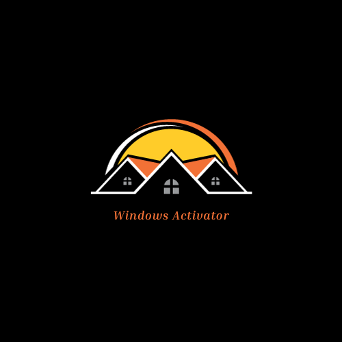
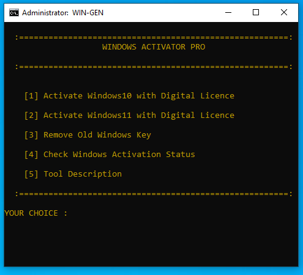
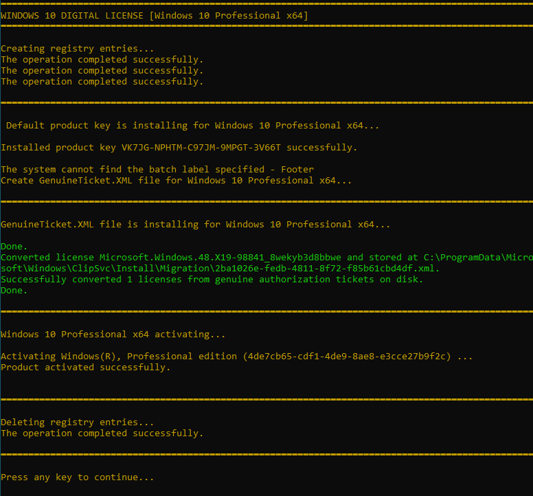
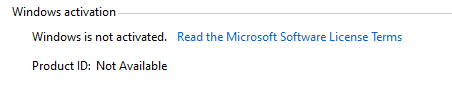
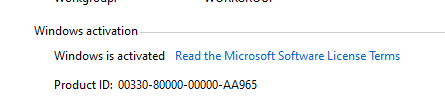

  
  <h1>Windows-Activator</h1>
   
  
<i> Activate your windows Automatically on Windows 10 and 11 within minues. 
   
    Created in batchfile with powershell by<a href="https://twitter.com/Smukx07"> @Smukx</a> .</i>

   
    
  
  
  <b><i></i></b>

## STEPS TO USE THIS TOOL

* Disable Antivirus if any Error was found .
* Run Windows-Activor.bat
* If you are reactivating windows again . Select 3 Option to delete old windows keys and registers .
* If you are activating windows 10 Press 1 . If activating windows 11 press 2 .
* Windows 10 Offline Installation .
* Windows 11 Actiavtion Requires Internet connection.
* 
## Some Screenshots of using this tool

### Windows 10 Activation Results

**Before using this tool**

 

**After using the tool**

### Windows 11 Activation Results

### Problems 

If you find any errors while installing. Make sure that you have removed the old key .
To Remove old keys Select option 4 to recover .

### ABOUT

If you like this tool consider giving a star so that i get motivated and write some tools

